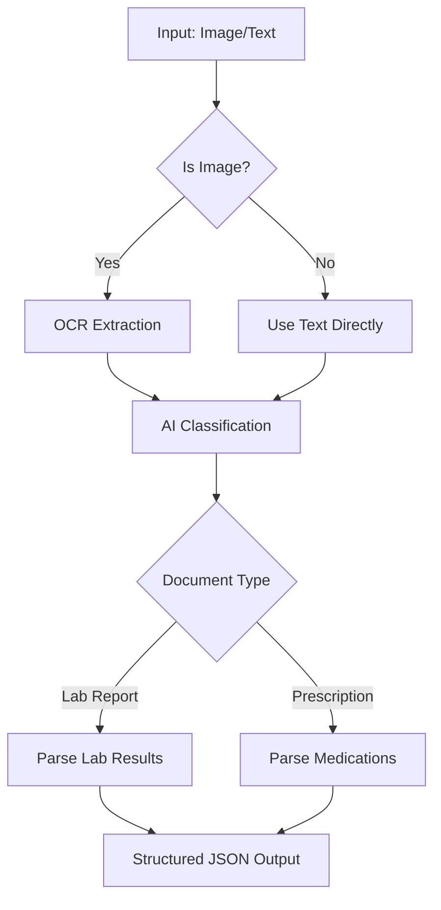

# Medical Document Triage System

A Python-based system that automatically processes medical documents (lab reports and prescriptions) using OCR and AI classification/parsing.

## 🏥 Overview

This triage system automates the processing of medical documents by:
1. **OCR Extraction** - Extracting text from medical document images
2. **Classification** - Determining document type (Lab Report or Doctor Prescription)
3. **Parsing** - Extracting structured data based on document type

## 📁 Project Structure

```
Triage/
├── main.py           # Main pipeline orchestrator
├── api.py            # Groq API client configuration
├── ocr.py            # OCR text extraction using Tesseract
├── classifier.py     # Document classification using AI
├── parsers.py        # Document parsing (lab reports & prescriptions)
├── .env              # Environment variables (API keys)
├── .gitignore        # Git ignore file
├── output.txt        # OCR output sample
├── lab_report.png    # Sample lab report image
├── pres.png          # Sample prescription image
└── __pycache__/      # Python cache files
```

## 🚀 Features

- **Multi-format Input**: Supports both image files and text input
- **OCR Processing**: Extracts text from medical document images using Tesseract
- **AI Classification**: Uses Groq's Gemma2-9B model to classify documents
- **Structured Parsing**: Converts unstructured text into structured JSON data
- **Two Document Types**:
  - **Lab Reports**: Extracts test names, results, units, and reference ranges
  - **Prescriptions**: Extracts medication names, dosages, and instructions

## 🛠️ Installation

### Prerequisites
- Python 3.7+
- Tesseract OCR

### Install Tesseract OCR

**Windows:**
1. Download from [GitHub Tesseract releases](https://github.com/UB-Mannheim/tesseract/wiki)
2. Install and add to PATH

**macOS:**
```bash
brew install tesseract
```

**Linux:**
```bash
sudo apt-get install tesseract-ocr
```

### Python Dependencies
```bash
pip install groq pillow pytesseract python-dotenv
```

### Environment Setup
1. Create a `.env` file in the project root:
```env
GROQ_API_KEY=your_groq_api_key_here
```

2. Get your Groq API key from [Groq Console](https://console.groq.com/)

## 📖 Usage

### Command Line Interface
```bash
# Process an image file
python main.py path/to/medical_document.jpg

# Examples
python main.py lab_report.png
python main.py pres.png
```

### Programmatic Usage
```python
from main import triage_pipeline

# Process an image
result = triage_pipeline("medical_document.jpg", is_image=True)

# Process text directly
result = triage_pipeline("Doctor's prescription text...", is_image=False)
```

## 🔄 Pipeline Workflow



## 📊 Output Examples

### Lab Report Output
```json
[
  {
    "test_name": "Hemoglobin",
    "result": "14.2",
    "unit": "g/dL",
    "reference_range": "12.0-15.5"
  },
  {
    "test_name": "White Blood Cells",
    "result": "7.8",
    "unit": "K/uL",
    "reference_range": "4.0-11.0"
  }
]
```

### Prescription Output
```json
{
  "medications": [
    {
      "name": "Amoxicillin",
      "dosage": "500mg",
      "instructions": "Take twice daily for 7 days"
    },
    {
      "name": "Ibuprofen",
      "dosage": "400mg",
      "instructions": "Take as needed for pain"
    }
  ]
}
```

## 🧩 Module Details

### `main.py`
- **Purpose**: Orchestrates the entire pipeline
- **Key Function**: `triage_pipeline(input_path_or_text, is_image)`
- **Workflow**: OCR → Classification → Parsing → JSON Output

### `ocr.py`
- **Purpose**: Text extraction from images
- **Library**: Tesseract OCR via pytesseract
- **Function**: `ocr_image(image_path)` → extracted text

### `classifier.py`
- **Purpose**: Document type classification
- **Model**: Groq's Gemma2-9B-IT
- **Output**: "LabReport" or "DoctorPrescription"
- **Function**: `classify_document(text, client)` → classification label

### `parsers.py`
- **Purpose**: Extract structured data from classified documents
- **Functions**:
  - `parse_lab_report(text, client)` → JSON with test results
  - `parse_prescription(text, client)` → JSON with medications

### `api.py`
- **Purpose**: Groq API client configuration
- **Security**: Loads API key from environment variables
- **Client**: Pre-configured Groq client instance

## 🔒 Security

- API keys are stored in `.env` file (not committed to Git)
- `.gitignore` prevents sensitive files from being uploaded
- Environment variables loaded securely using `python-dotenv`

## 🐛 Error Handling

- Invalid classification outputs are handled gracefully
- JSON parsing errors are caught and handled
- Missing input validation with usage instructions

## 🚧 Limitations

- Supports only English text
- OCR accuracy depends on image quality
- Limited to lab reports and prescriptions
- Requires Groq API key and internet connection

## 🔧 Development

### Adding New Document Types
1. Update `classifier.py` to include new document type
2. Add corresponding parser function in `parsers.py`
3. Update main pipeline logic in `main.py`

### Improving OCR Accuracy
- Preprocess images (noise reduction, contrast enhancement)
- Use different Tesseract OCR modes
- Implement confidence scoring

## 📄 License

This project is for educational and research purposes. Please ensure compliance with medical data regulations in your jurisdiction.

## 🤝 Contributing

1. Fork the repository
2. Create a feature branch
3. Make your changes
4. Add tests if applicable
5. Submit a pull request

## 📞 Support

For issues and questions, please open an issue in the GitHub repository.
